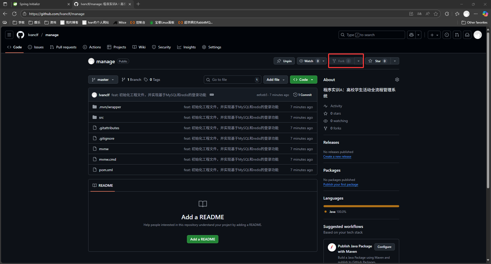
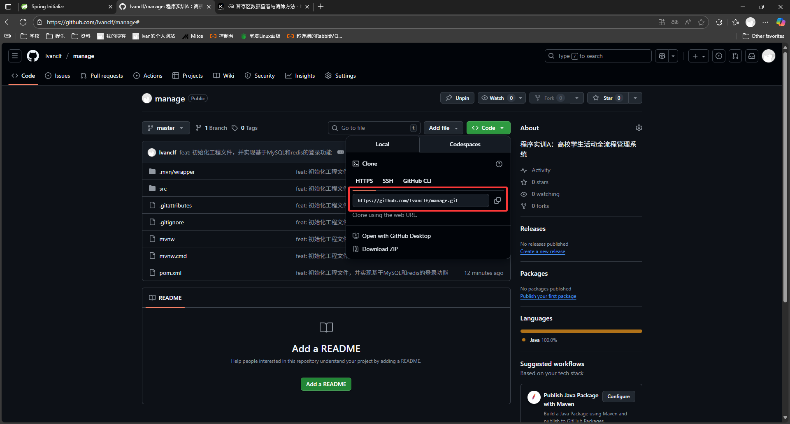

# 高校学生活动全流程管理系统

该系统是程序实训A的作业，现尝试进行合作开源开发。进行合作开发的流程如下

### `fork`

点击fork，在自己的GitHub仓库中保存一份完全一样的副本



### `clone`

在**自己的仓库**找到并复制对应的**HTTPS链接**




如果自己在GitHub上放有SSH公钥，也可以使用SSH链接。这个链接更加稳定，推荐使用。绑定SSH的方法可以在网上找。

本地下载好git，在合适的文件夹执行指令

```bash
git clone git@github.com:Ivanclf/manage.git
```

此处使用的是我的SSH链接，实际使用还是要用自己的链接

这样，自己本地也有了一份仓库

### `add` & `commit`

写好内容后，首先执行命令

```bash
git add .
```

将写好的代码全部放到暂存区。然后执行命令

```bash
git commit
```

进行推送。推送前需要先用vim写一段文档。文档遵从以下的规范

- `feat` 新功能
- `fix` 修bug
- `docs` 文档
- `refactor` 重构
- `test` 写测试类
- `chore` 构建/工具变动

如第一次提交的信息为

```
feat: 初始化工程文件，并实现基于MySQL和redis的登录功能
- 初始化项目基础结构和依赖配置
- 新增管理员登录模块
  - 实现管理员通过id登录
  - 账号登录功能仍有bug，需要修改
  - 登录成功后将管理员相关信息和其token写入redis
```

当然，不使用git bash的话，使用IDEA和VSCode的git GUI页面也可以，但文档规范也得遵守。

### `push`

一般来说，不通过 download ZIP 的文件都是有 remote 分支的，直接

```bash
git push
```

就行。如果有问题，一般就是 `remote` 分支出了问题。

### `pull request`

然后 GitHub 页面会有相应按钮。点进去会创建一个 `pull request`，创建好并发送后，会在他人的 GitHub 和邮箱上发送通知，他人确认完毕后可以合并分支（或者 `rebase` ）。至此，一次提交过程结束。

### `pull`

若发生提交冲突，进行冲突修改可能会是相当折磨的一件事。因此**开始工作前一定要`pull`**。以及一定要沟通好自己要完成什么工作，避免冲突。

```bash
git pull
```

如果远程库在编辑时发生了改动，则需要

```bash
git stash && git pull && git stash pop
```